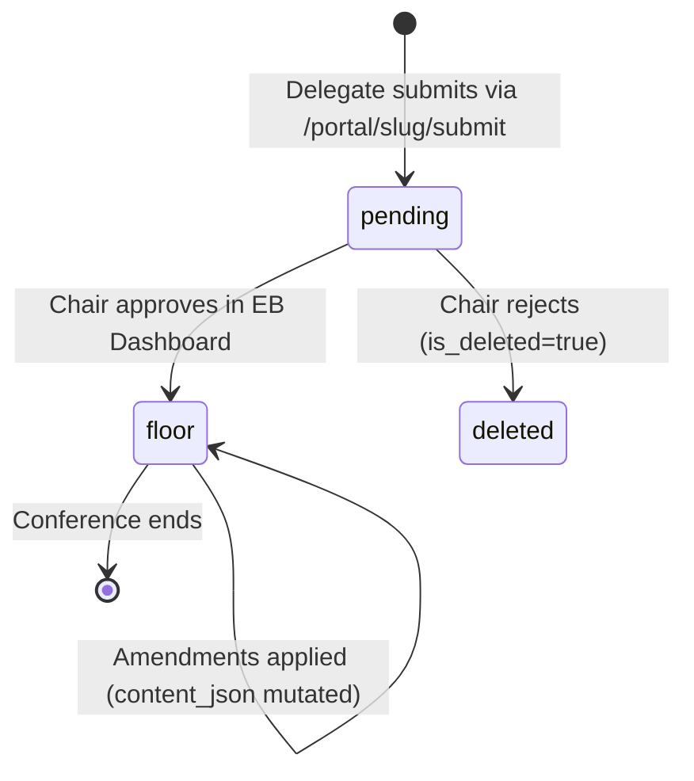
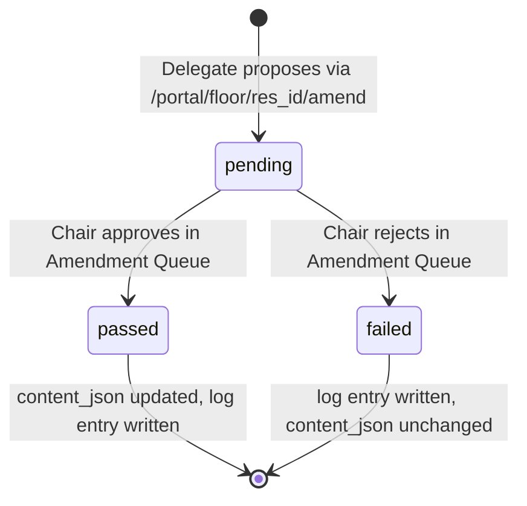

# Design Document: SISMUN Digital Ledger Redesign

## Overview

The SISMUN Digital Ledger is a Next.js 14 / Supabase application that manages the full lifecycle of MUN resolutions — from delegate submission through EB review to live floor display. The system has recently migrated from a centralized EB-drafting model to a **Delegate Submission model**, and this redesign completes three remaining areas:

1. **Amendment Integration** — enforce floor-only amendment eligibility and wire the EB amendment review queue into the approval flow with a full audit trail.
2. **UI Polish** — ensure the `pending → floor` status transition is seamless across all portal views, and that committee-specific routing is strictly isolated.
3. **End-to-End Verification** — validate the complete flow from public delegate submission through EB approval to live display on the public committee page.

### Key Design Principles

- **No new infrastructure**: all work is within the existing Next.js 14 App Router + Supabase stack.
- **RLS as the security boundary**: authorization is enforced at the database layer via Row Level Security policies, with application-layer checks as a secondary guard.
- **Optimistic UI with server revalidation**: client components use `useTransition` + `router.refresh()` for immediate feedback; server actions call `revalidatePath` to keep server-rendered pages fresh.
- **Immutable audit trail**: `amendment_log` is append-only; no updates or deletes are permitted on it.

---

## Architecture

The system follows Next.js 14's App Router architecture with a clear separation between public (unauthenticated) and authenticated surfaces.

```mermaid
graph TD
    subgraph Public
        A[Delegate Browser] -->|POST anon| B[/portal/slug/submit]
        A -->|GET anon| C[/portal/slug]
        A -->|GET anon| D[/portal/floor/res_id]
        A -->|GET anon| E[/committees/slug]
        A -->|POST anon| F[/portal/floor/res_id/amend]
    end

    subgraph Authenticated EB
        G[EB Browser] -->|GET auth| H[/portal/eb]
        G -->|GET auth| I[/portal/eb/amendments]
        G -->|Server Action auth| J[lib/actions/resolutions.ts]
        G -->|Server Action auth| K[lib/actions/amendments.ts]
    end

    subgraph Supabase
        L[(resolutions)]
        M[(blocs)]
        N[(amendments)]
        O[(amendment_log)]
        P[(conference_settings)]
        Q[(eb_profiles)]
    end

    B --> M
    B --> L
    C --> L
    D --> L
    D --> N
    D --> O
    E --> L
    F --> N
    H --> L
    I --> N
    J --> L
    J --> M
    K --> N
    K --> L
    K --> O
```

### Data Flow: Resolution Lifecycle



### Data Flow: Amendment Lifecycle



---

## Components and Interfaces

### Server Actions

#### `lib/actions/resolutions.ts`

| Function | Auth Required | Description |
|---|---|---|
| `createResolution` | EB | Creates a drafting resolution (legacy EB flow) |
| `updateResolutionContent` | EB | Updates content_json with optimistic concurrency |
| `submitResolution` | EB | Transitions drafting → floor, checks accepting_submissions |
| `softDeleteResolution` | EB | Sets is_deleted=true |
| `createBloc` | EB | Creates a bloc row |
| `updateBloc` | EB | Updates bloc name/countries |

**Gap identified**: The `submitResolution` action transitions `drafting → floor`, but the delegate submission flow inserts directly with `status = 'pending'`. The EB approval action in `EBReviewPanel` uses a direct Supabase client call (not a server action) to transition `pending → floor`. This should be extracted into a dedicated server action `approveResolution` and `rejectResolution` for consistency and testability.

#### `lib/actions/amendments.ts`

| Function | Auth Required | Description |
|---|---|---|
| `proposeAmendment` | None (anon) | Validates floor status, checks settings, rate-limits, inserts amendment |
| `approveAmendment` | EB | Applies amendment to content_json, writes audit log |
| `rejectAmendment` | EB | Sets vote_status='failed', writes audit log |

**Gap identified**: `rejectAmendment` currently does not record `clause_before`/`clause_after` in the audit log. It must be updated to fetch the current clause text before writing the log entry (Requirement 8.1).

### Page Components

| Route | Type | Auth | Description |
|---|---|---|---|
| `/portal/[slug]/submit` | Client Component | None | Delegate resolution submission form |
| `/portal/[slug]` | Server Component | None | Committee floor — lists floor resolutions |
| `/portal/floor/[res_id]` | Server Component | None | Single resolution view with amendment tabs |
| `/portal/floor/[res_id]/amend` | Client Component | None | Amendment proposal form |
| `/portal/eb` | Server Component | EB | EB dashboard — pending resolution review |
| `/portal/eb/amendments` | Server Component | EB | Amendment queue |
| `/committees/[slug]` | Server Component | None | Public committee page with CommitteeLedger |

### UI Components

| Component | Location | Description |
|---|---|---|
| `EBReviewPanel` | `components/portal/EBReviewPanel.tsx` | Client component for approving/rejecting pending resolutions |
| `PendingResolutionCard` | `components/portal/PendingResolutionCard.tsx` | Individual resolution card in EB dashboard |
| `AmendmentQueueList` | `components/portal/AmendmentQueueList.tsx` | Client component for approving/rejecting amendments |
| `ResolutionViewer` | `components/portal/ResolutionViewer.tsx` | Renders resolution content_json as formatted document |
| `AmendmentList` | `components/portal/AmendmentList.tsx` | Tabbed view of pending/resolved amendments and history |
| `CommitteeLedger` | `components/committees/CommitteeLedger.tsx` | Public-facing ledger on committee pages |

### New Components Required

| Component | Description |
|---|---|
| `ConferenceSettingsPanel` | SG-only panel in EB dashboard to toggle accepting_submissions / accepting_amendments |
| `SubmissionClosedBanner` | Displayed on `/portal/[slug]/submit` when accepting_submissions=false |
| `AmendmentClosedBanner` | Displayed on `/portal/floor/[res_id]/amend` when accepting_amendments=false |

---

## Data Models

All tables are defined in `lib/db-migration.sql`. The models below document the current schema and the gaps that need to be addressed.

### `resolutions`

```typescript
type Resolution = {
  id: string;                    // UUID PK
  bloc_id: string;               // FK → blocs.id
  committee_slug: string;        // e.g. 'ga4', 'sc'
  topic_index: number;           // 0 or 1
  status: 'pending' | 'floor';  // NOTE: 'drafting'/'submitted' exist in DB but not used in delegate flow
  content_json: ContentJson;     // { preamble: Clause[], operative: Clause[] }
  snapshot_json: ContentJson | null;
  submitted_at: string | null;   // ISO timestamp, set when approved to floor
  updated_at: string;
  created_at: string;
  is_deleted: boolean;
};
```

**Gap**: The DB schema has `status CHECK (status IN ('drafting', 'submitted', 'floor'))` but the delegate submission flow uses `'pending'`. The DB constraint must be updated to include `'pending'` and `'rejected'`, or the application must be aligned to use `'submitted'` for the pending-review state. **Decision**: Align the application to use `'pending'` as the pre-approval state and update the DB CHECK constraint to `('pending', 'floor', 'rejected')`. The `'drafting'` and `'submitted'` values from the legacy EB-drafting flow are no longer needed.

### `blocs`

```typescript
type Bloc = {
  id: string;
  committee_slug: string;
  topic_index: number;
  bloc_name: string;
  member_countries: string[];
  created_at: string;
};
```

### `amendments`

```typescript
type Amendment = {
  id: string;
  resolution_id: string;         // FK → resolutions.id
  clause_section: 'preamble' | 'operative';
  clause_position: number;       // float for fractional indexing
  target_position: number | null; // for 'add' type only
  proposer_name: string;
  proposer_country: string;
  committee_slug: string;        // must match parent resolution's committee_slug
  type: 'add' | 'strike' | 'modify';
  suggested_text: string | null; // null for 'strike'
  vote_status: 'pending' | 'passed' | 'failed';
  created_at: string;
  resolved_at: string | null;
  is_deleted: boolean;
};
```

### `amendment_log`

```typescript
type AmendmentLog = {
  id: string;
  amendment_id: string;          // FK → amendments.id
  resolution_id: string;         // FK → resolutions.id
  action: 'approved' | 'rejected';
  eb_profile_id: string;         // FK → eb_profiles.id
  clause_before: string | null;  // text of clause before change (modify/strike)
  clause_after: string | null;   // text of clause after change (modify/add)
  full_snapshot_json: object | null; // complete content_json after this amendment
  timestamp: string;
};
```

**Gap**: `rejectAmendment` currently inserts a log entry without `clause_before`/`clause_after`. For rejected amendments, these fields should remain null (no change was made), which is correct. However, the `full_snapshot_json` should still be recorded for rejected amendments to provide a complete audit trail. **Decision**: Update `rejectAmendment` to fetch and record `full_snapshot_json` from the current resolution content.

### `conference_settings`

```typescript
type ConferenceSettings = {
  id: 1;                         // singleton constraint
  accepting_submissions: boolean;
  accepting_amendments: boolean;
  debate_mode: boolean;
  conference_name: string;
  conference_date: string | null;
};
```

### `eb_profiles`

```typescript
type EBProfile = {
  id: string;                    // FK → auth.users.id
  name: string;
  committee_slug: string | null; // null = SG (sees all committees)
  role: 'chair' | 'sg';
  created_at: string;
};
```

### `ContentJson` (shared type)

```typescript
type Clause = {
  position: number;  // float, used for fractional indexing
  text: string;
  type: 'preamble' | 'operative';
};

type ContentJson = {
  preamble: Clause[];
  operative: Clause[];
};
```

---

## Correctness Properties

*A property is a characteristic or behavior that should hold true across all valid executions of a system — essentially, a formal statement about what the system should do. Properties serve as the bridge between human-readable specifications and machine-verifiable correctness guarantees.*

### Property 1: Valid submission creates pending rows

*For any* valid delegate submission (non-empty name, country, bloc name, at least one preamble clause, at least one operative clause, valid committee slug, valid topic index), submitting the form SHALL result in exactly one `blocs` row and one `resolutions` row with `status = 'pending'` being inserted into the database.

**Validates: Requirements 1.1**

---

### Property 2: Closed submissions gate blocks all inserts

*For any* valid delegate submission, if `conference_settings.accepting_submissions = false`, the submission SHALL be rejected with an error and no `blocs` or `resolutions` rows SHALL be inserted.

**Validates: Requirements 1.3, 7.1**

---

### Property 3: Invalid submissions are rejected without DB writes

*For any* delegate submission missing one or more required fields (submitter name, country, bloc name, topic, or all clauses of either type), the submission SHALL be rejected with a validation error and no rows SHALL be inserted.

**Validates: Requirements 1.4**

---

### Property 4: EB resolution data is scoped to committee

*For any* authenticated EB member (Chair or SG) and any set of resolutions across multiple committees, the resolutions returned by the EB dashboard query SHALL contain only resolutions where `committee_slug` matches the Chair's `committee_slug`, or all resolutions if the member is an SG (`committee_slug = null`).

**Validates: Requirements 2.1, 6.3, 6.4**

---

### Property 5: Resolution approval transitions state correctly

*For any* resolution with `status = 'pending'`, when a Chair from the same committee approves it, the resolution SHALL have `status = 'floor'` and a non-null `submitted_at` timestamp after the operation.

**Validates: Requirements 2.2**

---

### Property 6: Cross-committee actions are rejected

*For any* Chair and any resolution or amendment belonging to a different committee, any attempt to approve, reject, or modify that resource SHALL return an authorization error and SHALL NOT modify any database rows.

**Validates: Requirements 2.5, 4.7, 6.3**

---

### Property 7: Amendments are only accepted for floor resolutions

*For any* amendment proposal targeting a resolution with `status != 'floor'`, the proposal SHALL be rejected with an error and no row SHALL be inserted into `amendments`.

**Validates: Requirements 3.1, 3.2**

---

### Property 8: Closed amendments gate blocks all proposals

*For any* valid amendment proposal, if `conference_settings.accepting_amendments = false`, the proposal SHALL be rejected with an error and no row SHALL be inserted.

**Validates: Requirements 3.4, 7.2**

---

### Property 9: Amendment rate limit is enforced

*For any* combination of `(proposer_country, resolution_id)` that already has 5 or more `pending` amendments with `is_deleted = false`, any new amendment proposal from that country for that resolution SHALL be rejected with a rate-limit error.

**Validates: Requirements 3.5**

---

### Property 10: Amendment application preserves content integrity

*For any* resolution and any sequence of approved amendments (modify, strike, add), the resulting `content_json` SHALL reflect all applied changes: modified clauses have updated text, struck clauses are absent, and added clauses appear at the correct position sorted by `position` ascending.

**Validates: Requirements 4.2, 4.3, 4.4**

---

### Property 11: Rejected amendments do not modify content

*For any* amendment of any type, when a Chair rejects it, the resolution's `content_json` SHALL be identical before and after the rejection, and the amendment's `vote_status` SHALL be `'failed'`.

**Validates: Requirements 4.5**

---

### Property 12: Every amendment action produces a complete audit log entry

*For any* amendment approval or rejection, the `amendment_log` SHALL contain exactly one new entry recording: `amendment_id`, `resolution_id`, `eb_profile_id`, `action`, and `timestamp`. For approvals of `modify`/`strike` types, `clause_before` SHALL be non-null. For approvals of `modify`/`add` types, `clause_after` SHALL be non-null. For all approvals, `full_snapshot_json` SHALL be non-null and SHALL equal the resolution's `content_json` after the amendment was applied.

**Validates: Requirements 4.6, 8.1, 8.2, 8.3, 8.4**

---

### Property 13: Floor display shows only approved, non-deleted resolutions

*For any* committee slug and any set of resolutions with mixed statuses and `is_deleted` values, the floor display query SHALL return only resolutions where `status = 'floor'` AND `is_deleted = false`, ordered by `submitted_at` descending.

**Validates: Requirements 5.1, 5.2**

---

### Property 14: Amendment committee_slug matches parent resolution

*For any* amendment proposal, the `committee_slug` stored on the inserted `amendments` row SHALL equal the `committee_slug` of the parent resolution, regardless of what the proposer submits.

**Validates: Requirements 6.5**

---

### Property 15: Non-SG EB members cannot modify Conference_Settings

*For any* authenticated EB member with `role = 'chair'`, any attempt to update `conference_settings` SHALL be rejected by RLS with an authorization error and the row SHALL remain unchanged.

**Validates: Requirements 7.4**

---

### Property 16: Amendment history is ordered by timestamp descending

*For any* resolution with multiple `amendment_log` entries, the history tab in Floor_View SHALL display entries ordered by `timestamp` descending (most recent first).

**Validates: Requirements 8.6**

---

## Error Handling

### Validation Errors (Client-Side)

All forms perform client-side validation before submitting to the server:

- **Resolution submission** (`/portal/[slug]/submit`): required fields checked before `supabase.from('blocs').insert(...)`. Error displayed inline above the submit button.
- **Amendment proposal** (`/portal/floor/[res_id]/amend`): `suggested_text` required for `add`/`modify`, `target_position` required for `add`. Error displayed inline.

### Authorization Errors (Server Actions)

Server actions call `assertEBAccess(committeeSlug)` which throws `Error('Access denied: wrong committee')` if the authenticated user's `committee_slug` does not match. The calling client component catches this and displays it via `alert()` or a toast. **Improvement**: Replace `alert()` calls in `EBReviewPanel` and `AmendmentQueueList` with inline error state for better UX.

### Conference Settings Gate

Both `proposeAmendment` and the delegate submission form check `conference_settings` on every request. If the gate is closed:
- Delegate submission: displays a `SubmissionClosedBanner` component above the form, disables the submit button.
- Amendment proposal: displays an `AmendmentClosedBanner`, disables the submit button.
- Server-side: throws an error even if the client-side check is bypassed.

### 404 Handling

- `/portal/[slug]` and `/portal/[slug]/submit`: call `notFound()` if the slug is not in the `committees` data source.
- `/portal/floor/[res_id]`: the Supabase query filters `status IN ('floor')` and `is_deleted = false`; if no row is returned, `notFound()` is called.

### Optimistic Concurrency (Resolution Editing)

`updateResolutionContent` checks `updated_at` against `last_known_updated_at`. If a conflict is detected, it returns `{ conflict: true, server_updated_at }` and the client must re-fetch before retrying. This prevents silent overwrites when two EB members edit the same resolution simultaneously.

### Database Constraint Violations

Supabase errors are caught in server actions and re-thrown as `Error(error.message)`. Client components display these messages to the user. The `conference_settings` singleton constraint (`CHECK (id = 1)`) prevents duplicate rows at the DB level.

---

## Testing Strategy

### Unit Tests

Unit tests cover specific examples, edge cases, and pure logic functions:

- Clause sorting logic (fractional position ordering)
- `ContentJson` mutation functions (apply modify/strike/add to a clause array)
- Committee slug validation against the `committees` data source
- Form validation logic (empty fields, whitespace-only clauses)
- Rate limit count logic

### Property-Based Tests

Property-based testing is appropriate for this feature because:
- The core logic (amendment application, data scoping, status transitions) involves pure functions over structured data
- Input variation (different clause positions, amendment types, committee slugs, user roles) reveals edge cases
- 100+ iterations are cost-effective since the logic is in-memory (no AWS calls)

**Library**: [fast-check](https://fast-check.dev/) for TypeScript/JavaScript

**Configuration**: Minimum 100 runs per property test (`numRuns: 100` in fast-check config).

**Tag format**: `// Feature: sismun-digital-ledger-redesign, Property {N}: {property_text}`

Each correctness property maps to a single property-based test:

| Property | Test File | fast-check Arbitraries |
|---|---|---|
| P1: Valid submission creates pending rows | `__tests__/submission.property.test.ts` | `fc.record({ name: fc.string(), country: fc.string(), ... })` |
| P2: Closed submissions gate | `__tests__/submission.property.test.ts` | Same as P1 |
| P3: Invalid submissions rejected | `__tests__/submission.property.test.ts` | `fc.record` with one or more fields set to empty string |
| P4: EB data scoped to committee | `__tests__/eb-scoping.property.test.ts` | `fc.record({ role: fc.constantFrom('chair','sg'), committee_slug: ... })` |
| P5: Approval transitions state | `__tests__/resolution-lifecycle.property.test.ts` | `fc.uuid()` for resolution IDs |
| P6: Cross-committee actions rejected | `__tests__/authorization.property.test.ts` | `fc.string()` for committee slugs |
| P7: Amendments only for floor resolutions | `__tests__/amendments.property.test.ts` | `fc.constantFrom('pending','rejected')` for status |
| P8: Closed amendments gate | `__tests__/amendments.property.test.ts` | Same as P7 |
| P9: Rate limit enforced | `__tests__/amendments.property.test.ts` | `fc.integer({ min: 5, max: 20 })` for existing count |
| P10: Amendment application integrity | `__tests__/amendment-application.property.test.ts` | `fc.array(clauseArbitrary)`, `fc.constantFrom('add','strike','modify')` |
| P11: Rejected amendments don't modify content | `__tests__/amendment-application.property.test.ts` | Same as P10 |
| P12: Audit log completeness | `__tests__/audit-log.property.test.ts` | `fc.constantFrom('approved','rejected')`, amendment type arbitraries |
| P13: Floor display filtering | `__tests__/floor-display.property.test.ts` | `fc.array` of resolutions with random statuses and is_deleted values |
| P14: Amendment committee_slug inheritance | `__tests__/amendments.property.test.ts` | `fc.string()` for committee slugs |
| P15: Non-SG cannot modify settings | `__tests__/authorization.property.test.ts` | `fc.record({ role: fc.constant('chair') })` |
| P16: History ordered by timestamp | `__tests__/audit-log.property.test.ts` | `fc.array` of log entries with random timestamps |

### Integration Tests

Integration tests verify the end-to-end flow against a real Supabase instance (or a local Supabase dev environment):

1. **Full resolution lifecycle**: delegate submits → EB approves → resolution appears on floor → delegate proposes amendment → EB approves amendment → content_json updated → audit log entry created.
2. **RLS enforcement**: anon user can insert into `blocs`/`resolutions` (pending), cannot update or delete. Authenticated non-SG cannot modify `conference_settings`.
3. **Conference settings gate**: toggle `accepting_submissions` off, verify submission fails; toggle back on, verify submission succeeds.

### Smoke Tests

- Supabase RLS `anon` role can INSERT into `blocs` and `resolutions` (with `status = 'pending'`).
- `conference_settings` singleton constraint prevents duplicate rows.
- `amendment_log` is readable by `anon` role.
- All 8 committee slugs in `data/committees.ts` resolve to valid portal routes.
